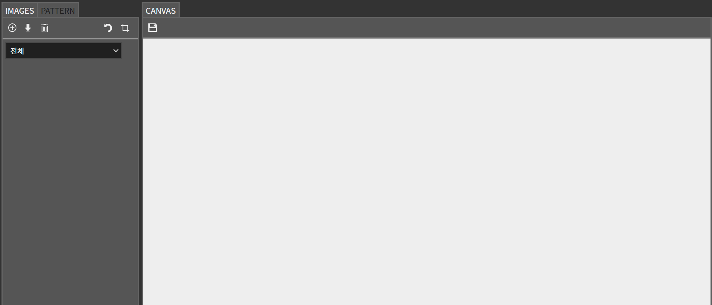
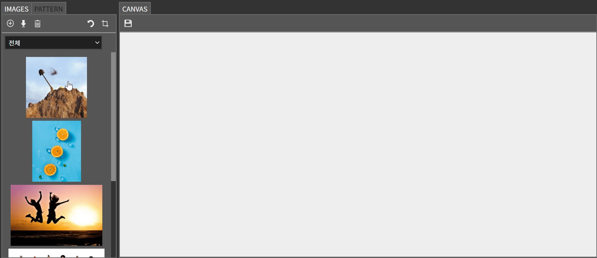
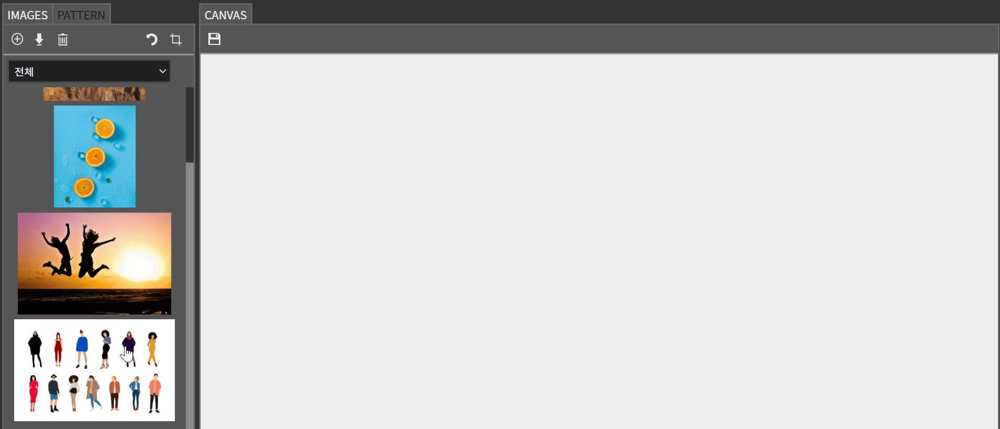
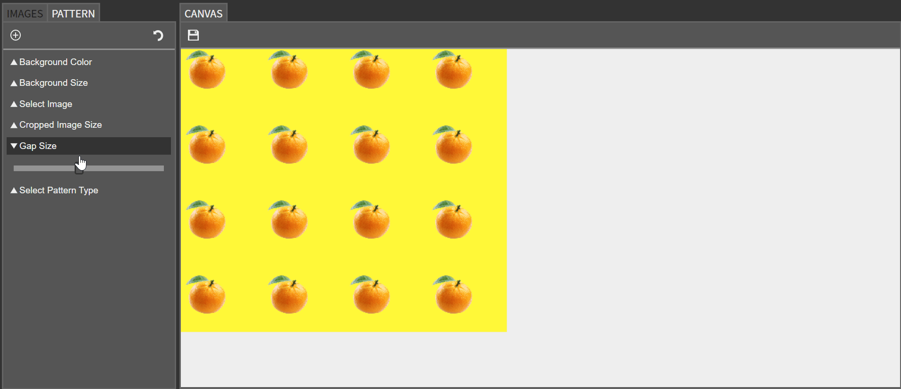
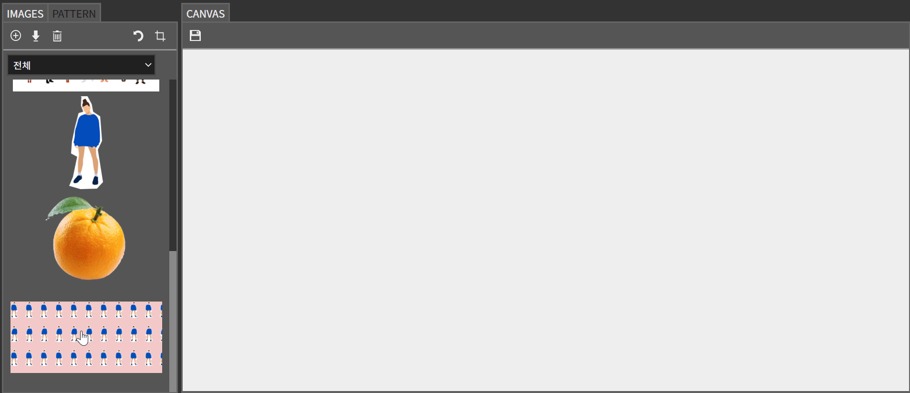

# Pictor (💬개발중💬)

## 픽토르 사용법 

### 패턴 메이커  

**✅ 이미지 업로드하기**

- **IMAGES 탭**에서 업로드한 이미지는 원하는 부분만 잘라내 패턴을 만드는 데 사용할 수 있습니다. 
  - 해당 이미지는 `원본` 카테고리에 포함됩니다. 
  - 원본 파일의 사이즈가 유지됩니다. 

- 곧바로 패턴 메이킹 시 사용할 이미지를 업로드 하려면, **PATTERN 탭**에서 업로드 합니다.
  - 해당 이미지는 `크롭` 카테고리에 포함되며, 업로드 즉시 패턴을 만드는 데 사용할 수 있습니다.
  - 이미지 사이즈는 `최대 300px * 300px` 값으로 자동 리사이즈됩니다. 

**✅ 이미지 선택 및 초기화** 

IMAGES 탭의 이미지 목록에서는 멀티 선택이 가능합니다. 

하지만 현재는 이미지 삭제를 제외한 나머지 기능(크롭, 패턴 만들기, 다운로드)들은 한 번에 하나의 이미지로만 작업이 가능하기 때문에, 편의를 위해 선택한 이미지들을 전부 초기화하는 버튼을 추가했습니다.  

**✅ 이미지 크롭하기**

패턴을 만들기 위해선 원하는 부분만 잘라낸 `크롭` 이미지를 생성해야 합니다. _(크롭이 번거롭거나 필요없다면, PATTERN 탭에서 이미지를 업로드하면 됩니다.)_

**✅ 패턴 만들기** 

아래의 옵션들을 설정해 패턴을 만들 수 있습니다. 
- 배경 컬러
- 배경 사이즈
- 이미지 
- 이미지 사이즈
- 이미지 간격 
- 패턴 종류 

또한 설정 초기화 버튼을 통해 선택한 이미지만 유지한 채, 상세 설정값들을 초기화할 수도 있습니다. 

**✅ 이미지 다운로드** 

픽토르에서 생성한 크롭 이미지나 패턴 이미지를 다운로드할 수 있습니다. 

